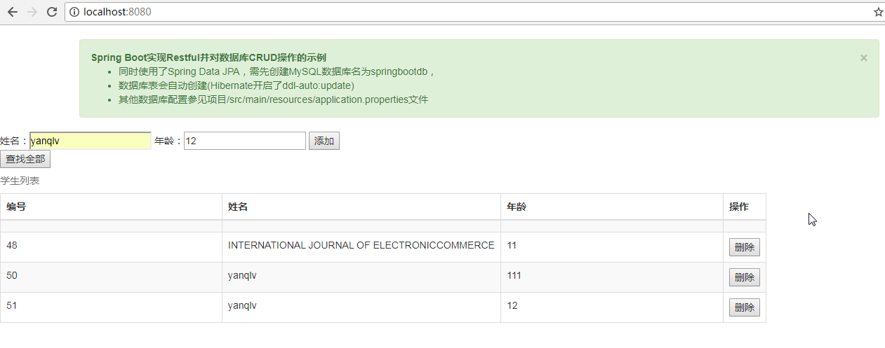

Spring Boot实现Restful并对数据库CRUD操作的示例
* 同时使用了Spring Data JPA，需先创建MySQL数据库名为springbootdb，
* 数据库表会自动创建(Hibernate开启了ddl-auto:update)
* 其他数据库配置参见项目/src/main/resources/application.properties文件
* 还使用了webjars引入jQuery和BootStrap等

