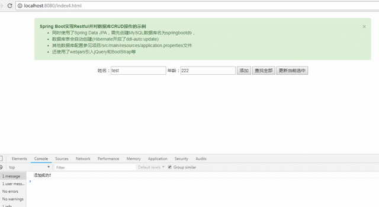

Spring Boot实现Restful并对数据库CRUD操作的示例
* 同时使用了Spring Data JPA，需先创建MySQL数据库名为springbootdb，
* 数据库表会自动创建(Hibernate开启了ddl-auto:update)
* 数据库配置参见项目/src/main/resources/application.properties文件

前端部分
* 使用了webjars引入jQuery、BootStrap、mustache.js、underscore.js、Vue.js等
* 分别使用如下三种方式的前端技术进行后端的CRUD操作进行通信
	* mustache.js前端模板引擎
	* underscore.js中的模板功能
	* Vue.js的MVVM框架

